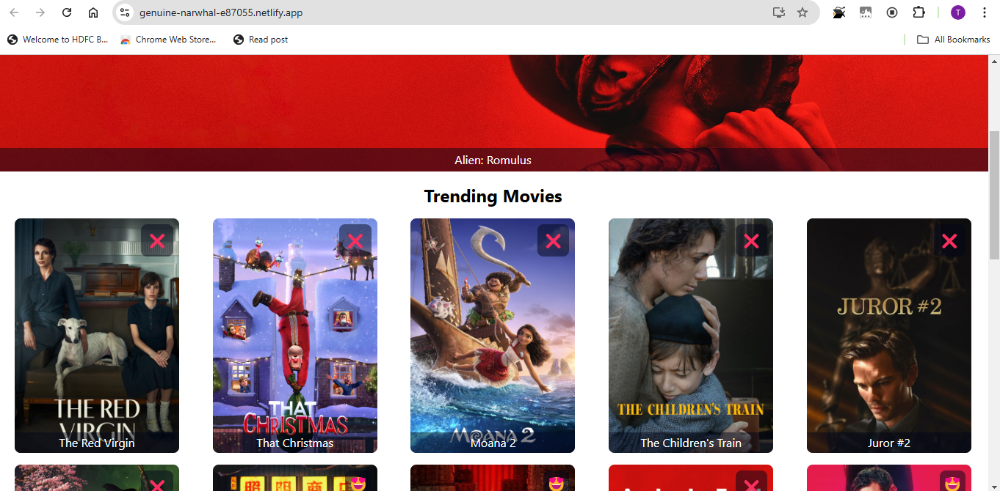
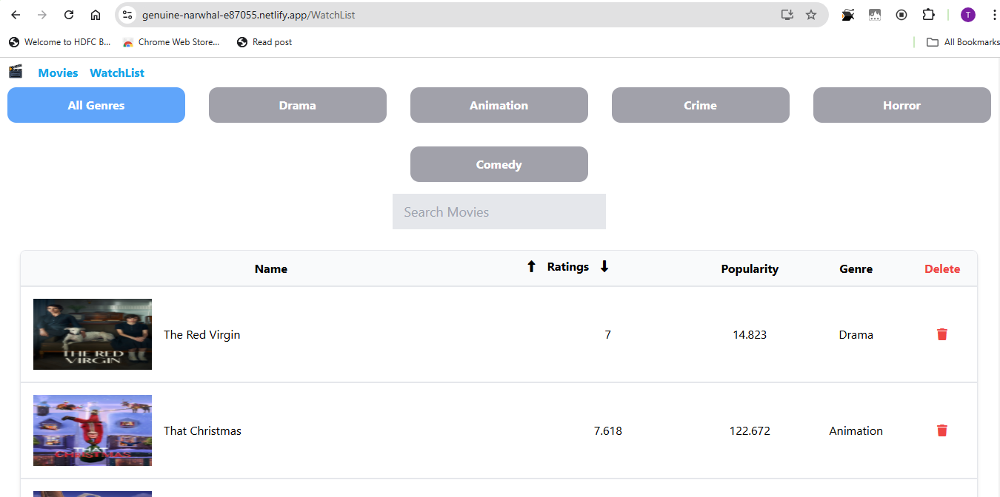

# 🎬 Movie Watchlist Application

## Overview

This is a React-based movie application that allows users to browse the latest movies, view their details, add movies to a watchlist, and manage their watched movies. The application leverages The Movie Database (TMDb) API to fetch movie data and provides features like pagination, genre filtering, and search functionality.

## 🌟 Features

- Browse latest movies with pagination
- Add/remove movies to watchlist
- Filter movies by genre
- Search movies in watchlist
- Sort movies by rating (ascending/descending)
- Responsive design

## 🖥️ Live Demo

[View Live Application](https://genuine-narwhal-e87055.netlify.app/)

## 🚀 Technologies Used

- React.js
- React Router
- The Movie Database (TMDb) API
- Tailwind CSS
- Font Awesome for icons

## 📦 Installation

1. Clone the repository
```bash
git clone https://github.com/Tharun-Balaji/movie-app.git
```

2. Install dependencies
```bash
npm install
```


3. Run the application
```bash
npm start
```

## 🔍 Component Breakdown

### Pagination Component

The pagination component is a crucial part of navigating through movie pages:

```jsx
function Pagination({
  Page_no,
  Handle_Left_Arrow_Btn,
  Handle_Right_Arrow_Btn
}) {
  return (
    <div className='text-2xl flex gap-8 bg-slate-400 m-2 p-4 justify-center'>
      <div className='cursor-pointer'>
        <i 
          className="fa-solid fa-arrow-left"
          onClick={Handle_Left_Arrow_Btn}
        ></i>
      </div>
      <div className='font-bold'>
        {Page_no}
      </div>
      <div className='cursor-pointer'>
        <i
         className="fa-solid fa-arrow-right"
         onClick={Handle_Right_Arrow_Btn}
        ></i>
      </div>
    </div>
  )
}
```

#### Pagination Logic Explained

The pagination component receives three key props:
- `Page_no`: Current page number
- `Handle_Left_Arrow_Btn`: Function to navigate to previous page
- `Handle_Right_Arrow_Btn`: Function to navigate to next page

The component renders:
- Left arrow icon to go to previous page
- Current page number
- Right arrow icon to go to next page

Each arrow is clickable and triggers the corresponding handler function to change the page.

### Watchlist Component Features

The watchlist component offers advanced filtering and sorting:

1. **Genre Filtering**: 
   - Dynamically generates genre buttons based on movies in the watchlist
   - Allows selecting/deselecting genres to filter movies

2. **Search Functionality**:
   - Real-time movie search within the watchlist
   - Case-insensitive search by movie title

3. **Sorting**:
   - Sort movies by rating in ascending or descending order
   - Uses `toSorted()` method for sorting

## 🖼️ Preview

### Home Page


### Watchlist Page


## 🤝 Contributing

1. Fork the repository
2. Create your feature branch (`git checkout -b feature/AmazingFeature`)
3. Commit your changes (`git commit -m 'Add some AmazingFeature'`)
4. Push to the branch (`git push origin feature/AmazingFeature`)
5. Open a Pull Request

## 📄 License

Distributed under the MIT License. See [`LICENSE.md`](LICENSE.md) for more information.

## 📞 Contact

Tharun Balaji - [tharunbalaji110@gmail.com](mailto:tharunbalaji110@gmail.com)

Project Link: [https://github.com/Tharun-Balaji/React.js/tree/main/React-Basics/movies-app](https://github.com/Tharun-Balaji/React.js/tree/main/React-Basics/movies-app)